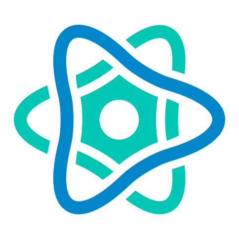
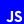

### Hi there, I'm Lopson

- 🌱 I’m currently learning everything connected to Javascript/Flutter.
- 👯 I'm looking to learn something from experienced programmers
- 🥅 2020 Goals: Contribute more to Open Source projects

### Connect with me:

[][linkedin]

 

### Languages and Tools:

 
 

---

  
:zap: Github Stats

  

[linkedin]: https://www.linkedin.com/in/lopson-balzhinimaev/
